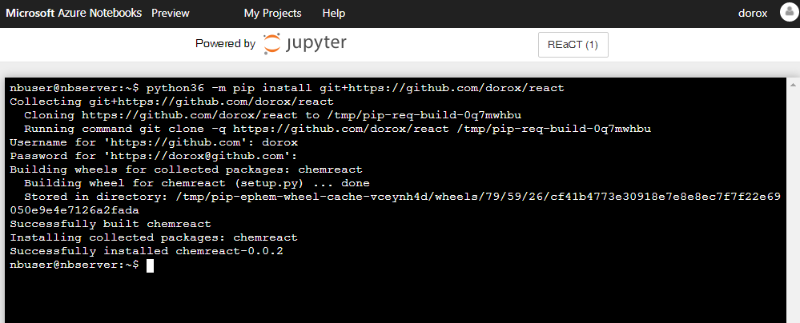
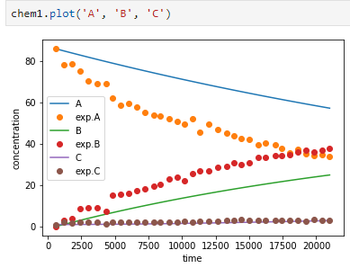
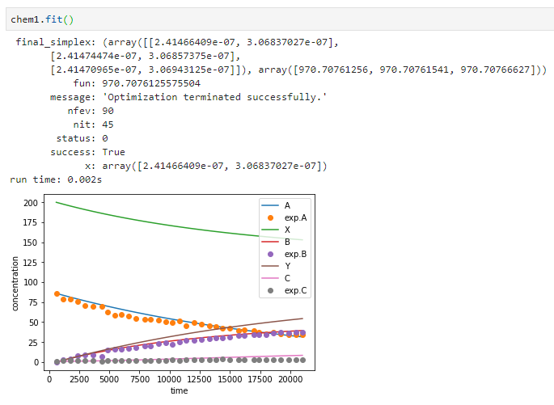
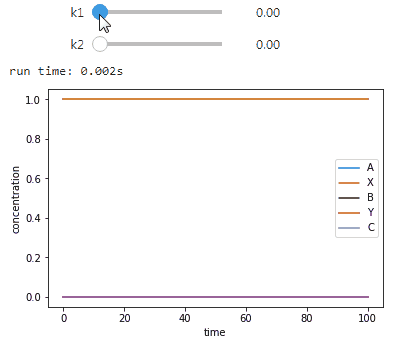

Reaction Engineering and Catalytic Technology (REaCT)
===============================
Modelling and experimental data integration for selected chemical problems.
This project contains demos of the Jupyter notebooks, representing potential use cases.

### Usage:
1. In order to get access to the program, create a [GitHub](https://github.com/) account and send me (<id814@ic.ac.uk>) your account name.
1. Login with your college account and clone the project using the `Clone` button above
1. First step before running your code: install the `chemreact` module from `https://github.com/dorox/react` (this needs to be done only once each time you login into Azure Notebooks.). This is done using the terminal:
    * open the terminal by pressing the `t` key, or clicking on a terminal button
    * copy this command |`python36 -m pip install git+https://github.com/dorox/react`| - make sure there are no spaces at the end of the line.
    * when asked, enter your github login details
    * the result should look like this: 
    
    
        
1. Open of the files from the list above, edit and run the code by running cells one by one starting from top.

List of examples
------------------------

click to view or run above

### Chemical mechanisms:
1. Examples of simple chemical reactions: `Chemistry_basics.ipynb`
1. Finding the kinetic constants from experimental data: `Chemistry_fitting.ipynb`
1. Advanced examples of oscillatory reactions (chemical clock, predator-prey): `Chemistry_Oscillations.ipynb`
1. Michaelis-Menten kinetics: approximated model and exact numerical solution(unfinished): `Chemistry_Michaelis-Menten.ipynb`
1. Reproducing experiments for activation energy measurements (to be simplified): `Activation_energy.ipynb`

### Continuous reactors: CSTR and PFR:
1. Examples of setups for dynamic systems with single reactors: `Reactors_basics.ipynb`
1. Combinations of reactors in series: `Flowsheet.ipynb`
1. Fitting experimental data from continuous reactors is currently not available.

### Modelling and experimental data:

### Curve fitting chemical model:

### Real-time model manipulation example:

